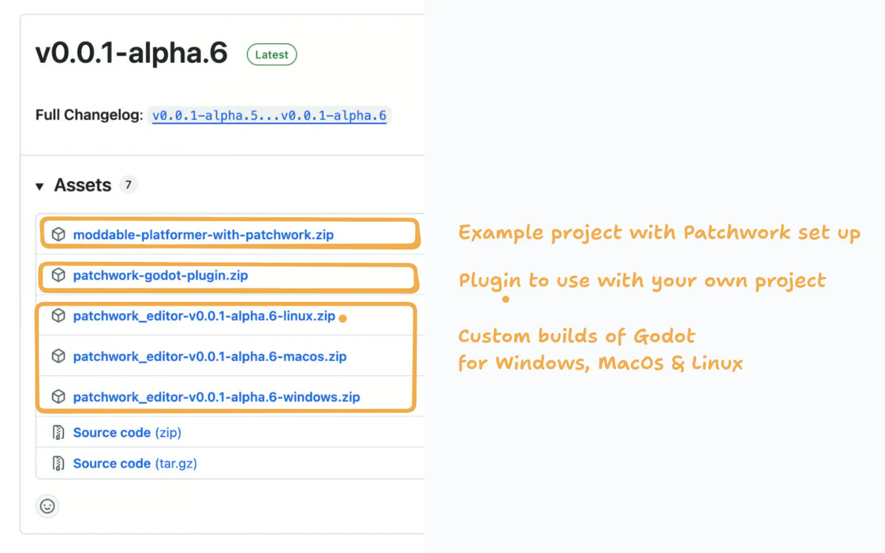
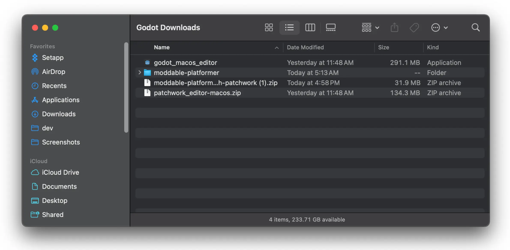
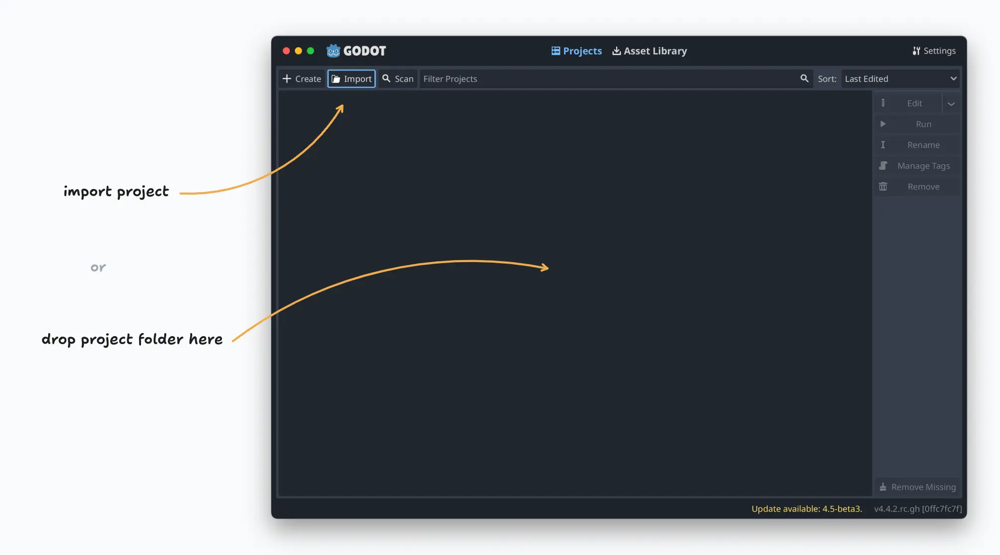
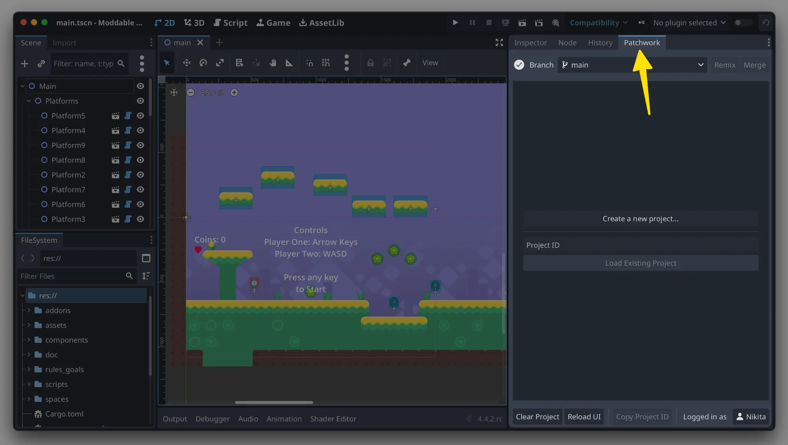
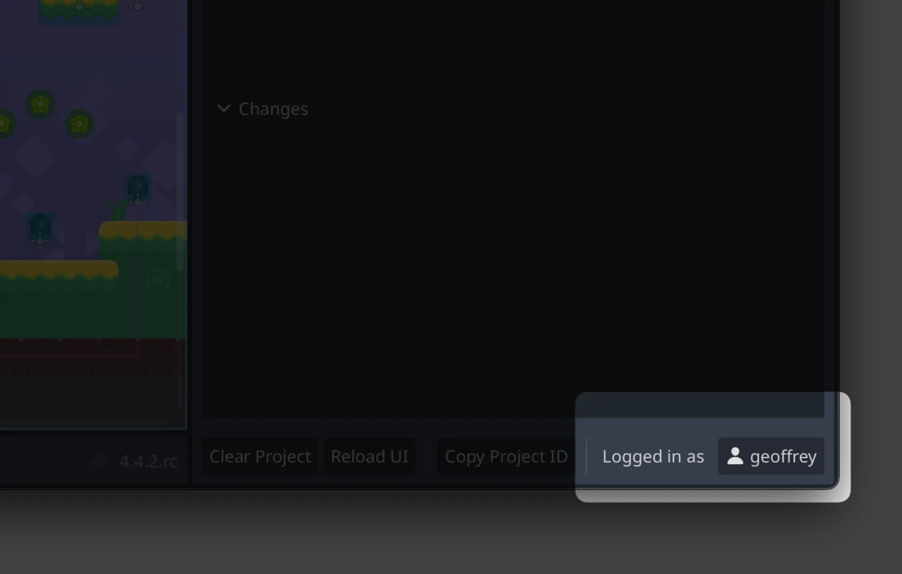
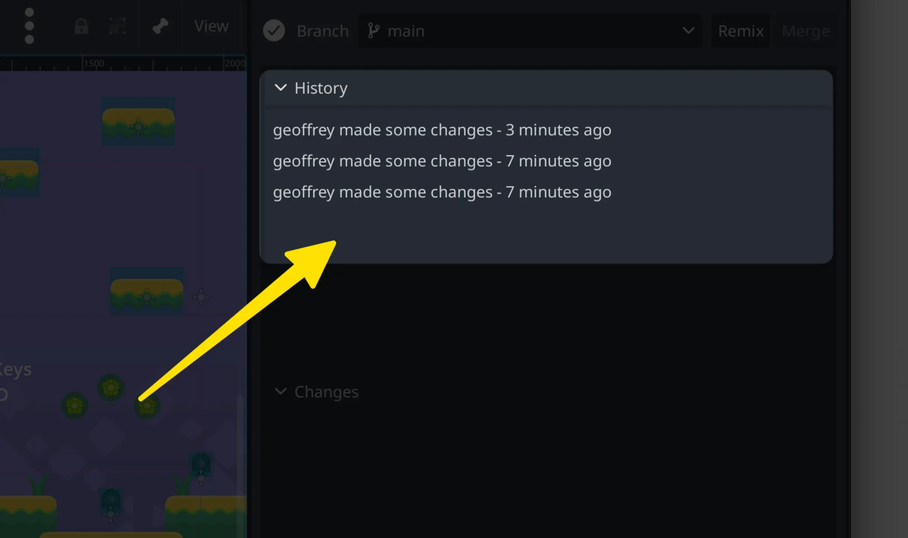
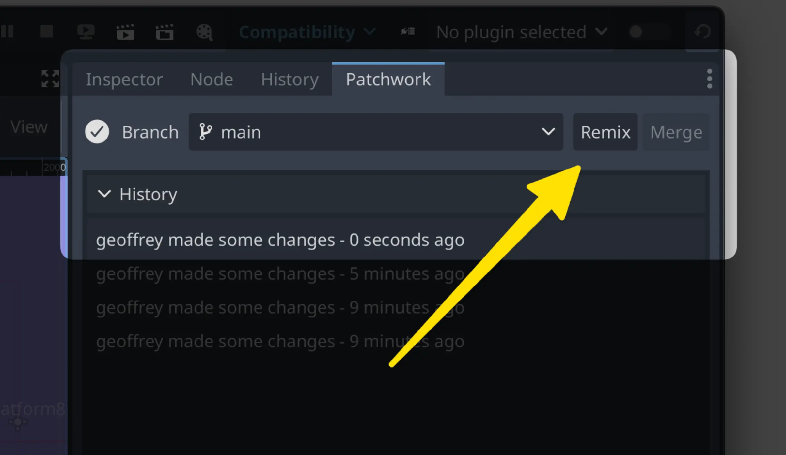
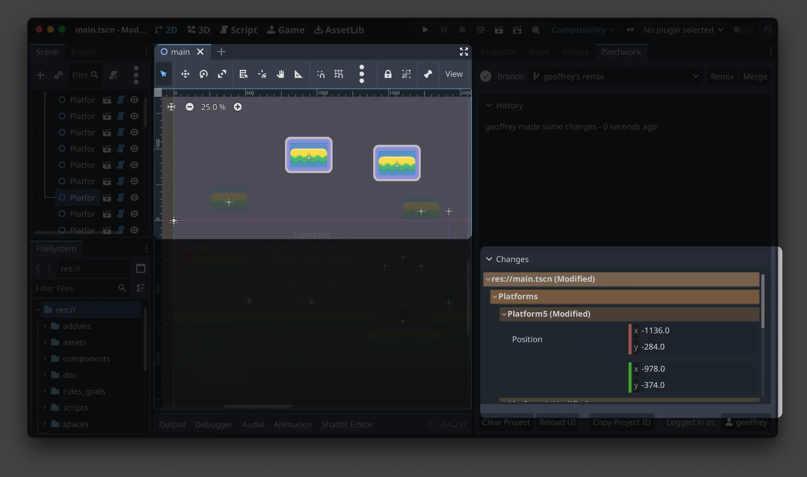
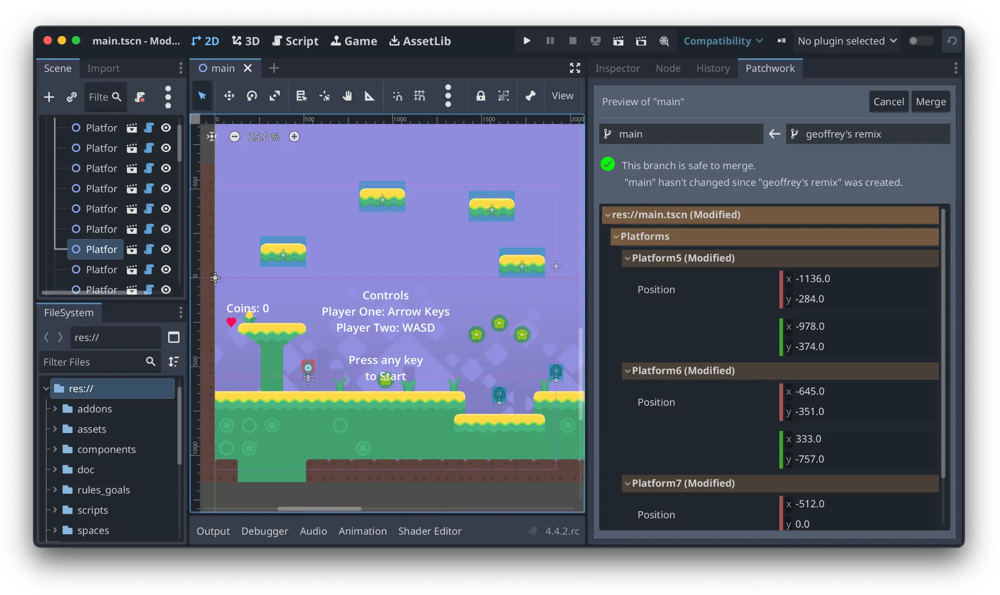

# Godot Collaboration Plugin: User's Guide

Welcome! This is a short guide to using the Godot collaboration plugin.

## Installation

To get started, you'll need to download:

1) a special install of the Godot editor, which includes extra functionality
2) the Patchwork plugin for Godot. This can be downloaded standalone, or as part of a starter project such as the Moddable Platformer

Download the latest version of the plugin from [Github](https://github.com/inkandswitch/patchwork-godot-plugin/releases)

Extract the zip files. You should see the Godot editor as well as the plugin (or the starter project containing the plugin)

Open the Godot editor. You should see the Projects screen:

Open the project that you downloaded earlier. (You can do this in the Godot file open dialog, or by dragging the folder into the Projects pane)

## Getting started

Most of the Godot editor works as you're used to.

To start using the Patchwork collaboration features, click the Patchwork tab in the right sidebar:

To collaborate with others, you need to be in the same Patchwork Project.

💡 A Patchwork Project is a shared online session where everyone can see the same thing. Think of it sort of like a Google Doc. If you're familiar with Git, it's also similar to a Git repo with live synchronization.

You can either create a new project or load an existing one.

⚠️ **IMPORTANT** Loading existing projects is a new feature that's only available in the latest version of the plugin. In older versions of the plugin a new project is automatically generated when you start the plugin for the first time.
If you want to share a project with another person you either need to zip up the whole project. Alternatively you can manually share the project id stored in the `patchwork.cfg` file in the root of the project folder.

### Making a new project

To create a new project: click the button to create a new project.

To share a project with someone:

- You can click the "Copy Project ID" button in the bottom toolbar and then send the Project ID to another user
- The project ID is also written into the filesystem, so if you share your project folder with someone it will now contain the Patchwork Project ID

### Joining an existing project

- manually paste the ID into the Project ID box if someone has shared that
- You may already be in a Patchwork project, if someone shared a file with you that contains a project ID.

## Using Patchwork

### Set your username

Start by entering a username in the bottom right corner. This will help identify you to other collaborators.

### Making changes directly on main

When you start out in a Project, you're editing on the main copy.

Anytime you save (ctrl-s or cmd-s), your changes will now be shared with all collaborators in the project.

⚠️ If you're making a larger change, or you're in a classroom setting where many people are working in the same project, then you should avoid editing directly on main, and instead work on a branch. See the next section.

You can see a log of recent changes by you and others in the History list.

### Making changes on a branch

A branch is a separate copy of the game that you can edit independently from others. Later on, you can "merge" this copy back into the main copy if you want.

To make a new branch, click "remix" and select a name.

Now you can make changes privately on this branch without disrupting others.

The history list now shows just a list of changes on this branch.

The "changes" panel in the bottom of the Patchwork pane shows you the difference between this branch and the main branch. If you hover on different parts of the change list you can see highlights on the changed parts in the scene.

If you want, you can make a branch off a branch by clicking Remix. Each branch starts where its parent left off.

### Merging a branch

You can "merge" a branch, which adds any edits from that branch into its parent branch. For example, a branch created from the main branch can be merged into main.

To do so, click the Merge button. You'll see a preview pane. This shows what will happen once the two branches merge together. If things look good, hit Merge again. If you want to make adjustments, you can do those adjustments here before merging, or you can Cancel to make more edits on the original branch before attempting the merge again.

### How to use branches

In a classroom setting, you could try:

- Each student makes their own branch
- Each team makes a branch, and different students collaborate in there. (Optionally, each team member could make their own branch off the team branch)

In a small collaborative team, you could try:

- Each major feature gets a branch, which gets merged when the feature is done
- Make a branch for a live jamming session on a game mechanic

## Troubleshooting

The plugin is still experimental software. Occasionally errors can happen.

As long as you're regularly saving your work, data loss is unlikely. All of your changes are still being saved to your computer's local filesystem.

If syncing is not working, you can try falling back to other methods of syncing data, like using a Git repository.

If the editor crashes or seems unresponsive, try restarting the editor.

# Developer Guide

If you want to contribute code to the plugin or build the plugin from scratch, [please check our detailed guide here](Developers.md).
